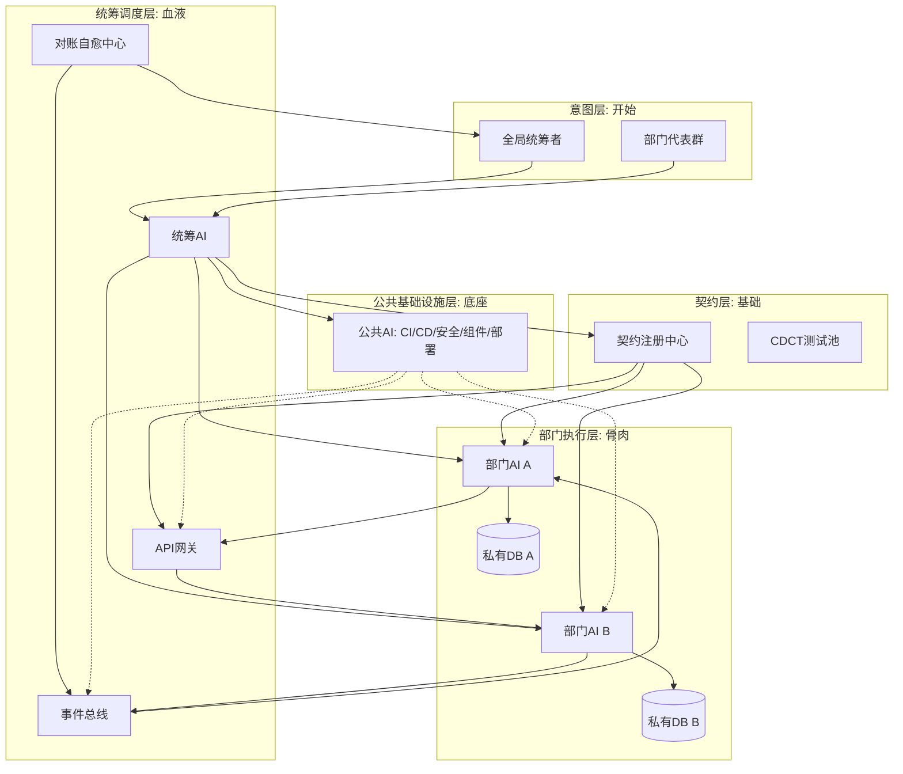

纯AI Code 6人团队架构图（概要版）

**契约是基础（地基），意图是开始（发令枪），协作血液（事件与调度），独立部门是骨肉（执行体）**。

### 五层架构解读
1. **意图层（开始）**：人类只输入结构化意图，沙盘推演发现死锁反向推给人类裁决。**人类立法，AI释法**。
2. **契约层（基础）**：系统核心护城河。契约进注册中心接受审查（只增不减），锁定后下发强制生成代码骨架，CDCT卡死后续变更。
3. **部门层（骨肉）**：5个自治孤岛，独立AI+私有DB，只看契约不关心其他部门实现。
4. **协作血液**：同步走API网关（海关拦截脏数据），异步走事件总线（状态变更秒传），对账中心定时比对指纹自动自愈。
5. **公共底座**：公共AI统一管理CI/CD、安全扫描、公共组件、部署环境。部门AI只写业务代码。

**目标**：零会议、零合并冲突、零脏数据污染。
