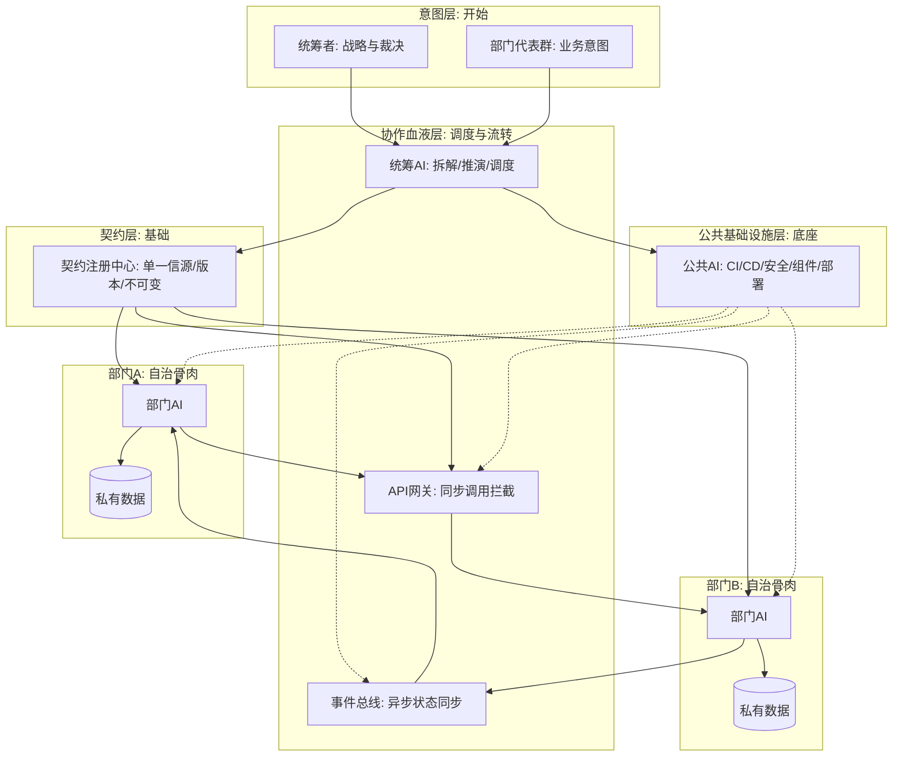

概要架构图（精简版）

**意图是开始（顶层），契约是基础（底层），协作血液（中间流转），独立部门是骨肉（两侧执行），公共AI是底座**。

### 五层解读
1. **顶层（意图）**：人类只在此层活动——输入战略业务意图，接收最高级冲突裁决。
2. **中间层（血液）**：统筹AI是心脏拆解调度，网关和总线是血管，所有跨部门交流必经此处。
3. **底座（契约）**：契约注册中心是地基，向网关提供校验规则，向部门AI下发强约束代码骨架。
4. **两侧（骨肉）**：部门A/B是平行自治孤岛，只认契约、只通过血液层交互、绝不越界。
5. **底层（公共AI）**：横向技术底座——CI/CD、安全扫描、公共组件、部署环境，部门AI不操心基础设施。

从上到下发令，从下到上支撑，中间流转，两侧自治，底层保障——纯AI公司完美闭环。
