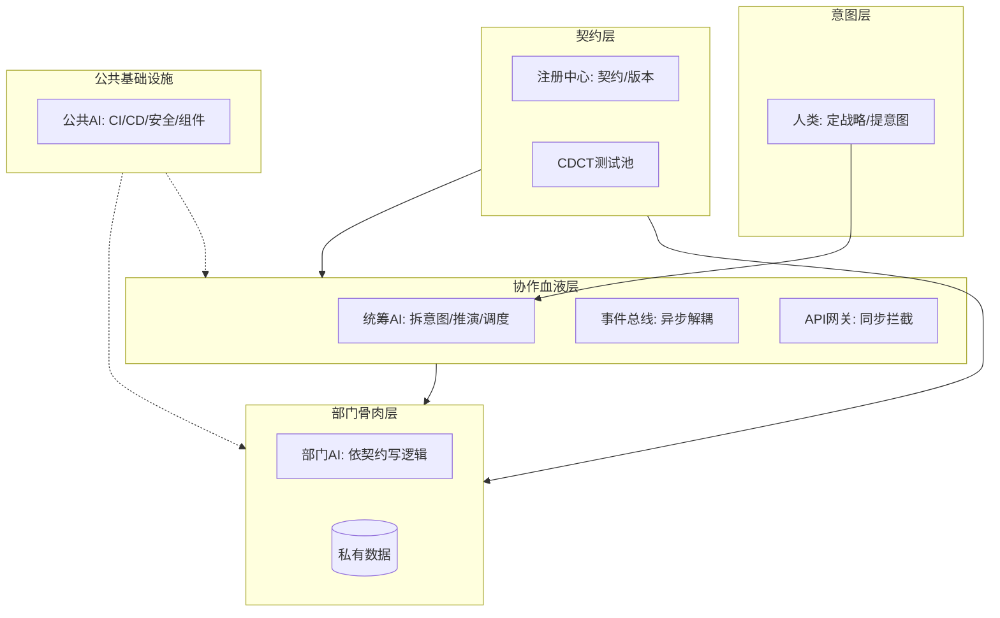

核心概念与术语解释（概要版）

---
### 核心术语
- **意图**：一切的开端。人类输入的结构化业务指令，包含目标、指标和边界。
- **契约**：稳固的地基。部门间的法律文书，严格规定API输入输出和数据结构。
- **主权隔离**：谁创建数据谁就是唯一主人，其他部门只能通过契约规定的接口交互。
- **CDCT（消费者驱动契约测试）**：谁使用接口谁出题，提供方上线前必须跑通所有消费方测试。
- **事件总线**：协作的血液（异步）。状态变更广播网，订阅方自动收到更新。
- **API网关**：协作的血液（同步）。跨部门调用的海关，严格校验请求响应。
- **物化视图**：消费方根据事件在本地建的只读速查表，仅用于高效展示。
- **公共AI**：横向技术底座，管理CI/CD、安全扫描、公共组件库、部署环境。
- **对账与自愈**：统筹AI定期比对部门数据指纹，不一致则自动下发补偿事件拉齐。

### 系统功能全景图

