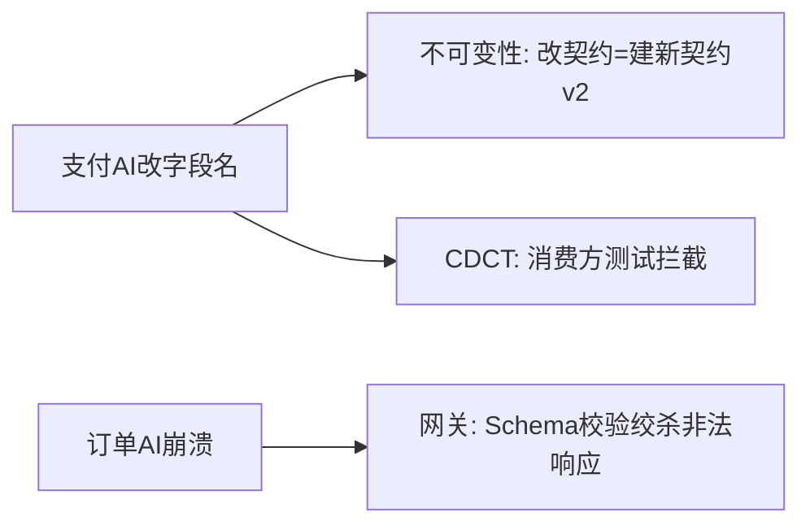

大纲一至五概要：契约与数据核心防线

---

### 大纲一：保证契约稳定性
**核心**：不可变+CDCT+网关拦截

- 已发布契约禁止修改，只能新增v2保留v1
- 消费者出题上传测试池，提供者每次提交必须通过
- 运行时网关实时比对Schema，不合规数据直接拦截

### 大纲二：确保版本控制
**核心**：注册中心+AST自动判定语义版本
- 契约即代码，单一信源，部门AI无权直接修改
- 破坏性变更（删字段/改类型）拒绝合并，强制新建主版本
- 版本与路由硬绑定，调用必须显式指明版本号

### 大纲三：兼容性与升级
**核心**：双轨运行+AI自动迁移
- 只允许可逆变更，破坏性操作直接拦截
- v1/v2并行双轨过渡，AI自动重构消费者切换版本
- 确认v1流量归零→人类点击确认→AI自动删除旧代码

### 大纲四：确保一致性
**核心**：全局Lint+单一信源+契约驱动
- 全局Lint强制执行命名法则和类型映射，不合规提交拒绝
- 核心实体统一定义，部门只能$ref引用禁止重写
- 契约先行→生成强类型桩代码→AI只准填肉不准改骨架

### 大纲五：跨部门数据同步
**核心**：主权隔离+事件驱动+对账自愈
- 绝对禁止跨库直接访问，API是唯一数据出口
- 状态变更发布事件到总线，消费方异步构建本地只读物化视图
- 统筹AI定期对账指纹比对，不一致自动下发补偿事件自愈
