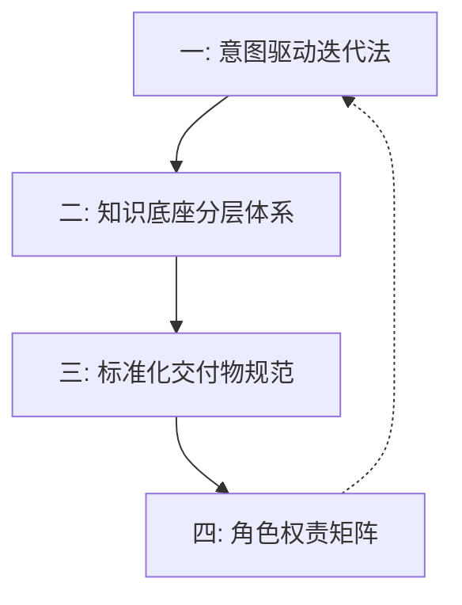
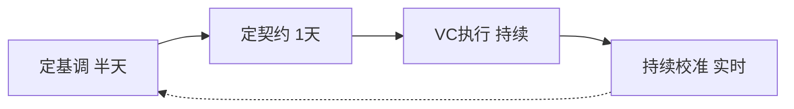
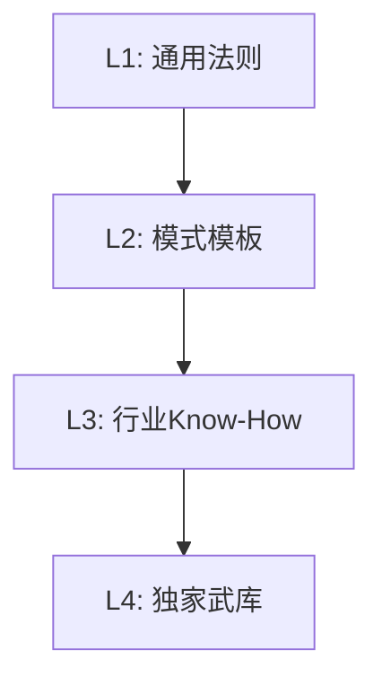
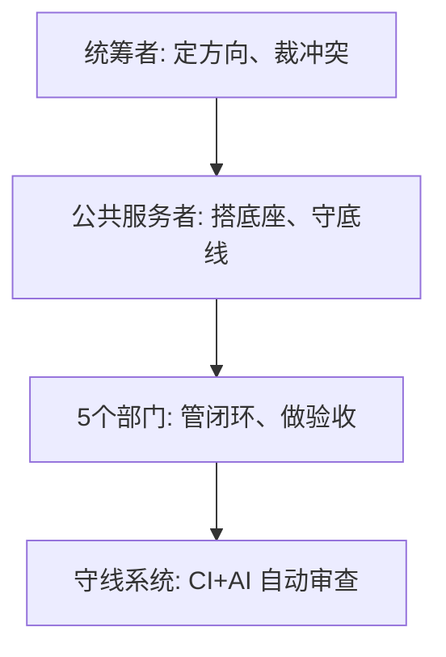

# Vibe Coding 原生架构方法论：四大支柱

## 背景

Vibe Coding 速度暴增但带来三个问题：
- **架构熵增**：各部门高速生成代码，系统快速混乱。
- **决策真空**：AI 不会替你决定框架、边界、数据流转。
- **知识蒸发**：AI 上下文有限，架构原则会被挤出。

**核心认知**：人靠"定方向、划边界、建底座、守底线"创造价值。

---

## 一、四大支柱全景图

四大支柱构成递进闭环：流程 → 弹药 → 标准 → 权责。

---

## 二、支柱一：意图驱动迭代法

- 四步闭环：定基调→定契约→VC执行→持续校准。
- 第四步每次提交自动纠偏，非事后复盘。

---

## 三、支柱二：知识底座分层体系

| 层级 | 内容 | 维护者 |
|:---|:---|:---|
| **L1** | 编程范式、安全铁律 | 公共服务者 |
| **L2** | 微服务、事件驱动模板 | 公共服务者 + 团队 |
| **L3** | 业务规则、合规标准 | 业务域负责人 |
| **L4** | 历史踩坑、禁用清单 | 公共服务者强制 |

- 从通用到独家优先级递增。L4 同时是 CI 硬拦截规则。

---

## 四、支柱三：标准化交付物规范

- 传统文档"人读了去做"，VC 交付物"自动执行"——AI 读取、CI 校验。
- 五类：CLAUDE.md、OpenAPI YAML、.cursorrules、CI 拦截规则、TODO 切片。

---

## 五、支柱四：角色权责矩阵

| 角色 | 核心职责 |
|:---|:---|
| **统筹者** | 定方向、划边界、裁冲突 |
| **公共服务者** | 选武器、搭底座、守底线 |
| **部门负责人** | 管闭环、定意图、做验收 |
| **守线系统** | 契约合规、安全隔离检查 |

---

## 总结

| 支柱 | 核心思想 |
|:---|:---|
| **意图驱动迭代法** | 定基调→定契约→VC执行→持续校准 |
| **知识底座分层体系** | 通用法则→模式模板→行业KnowHow→独家武库 |
| **标准化交付物规范** | 给人读的文档 → 给AI读的契约和自动规则 |
| **角色权责矩阵** | 统筹者定方向、公共服务者搭底座、部门负责人管闭环、守线系统自动审查 |
