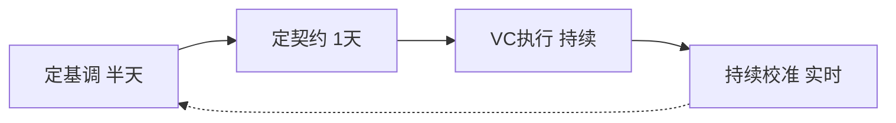
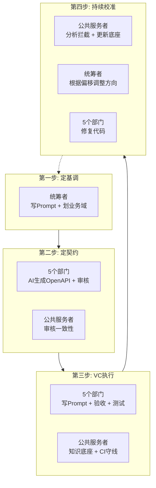

# 意图驱动迭代法：从方向到交付的四步极速闭环

## 背景

传统流程假设"人是执行瓶颈"——需求 2 周、设计 2 周、编码 4 周。Vibe Coding 击碎了这个假设。

**核心答案**：人的时间应花在"让 AI 写对代码"上，而非"替 AI 写代码"上。

---

## 一、核心思想

传统流程 7 环节、12 周周期；意图驱动 4 步、3 天闭环。

**核心区别**：第四步每次提交自动纠偏，非事后复盘。

---

## 二、四步详细拆解

### 第一步：定基调（半天）

统筹者将产品方向转化为 System Prompt（CLAUDE.md）：
- 业务范围：核心闭环 + 不做清单。
- 业务域划分：各部门职责边界。
- 全局约束：技术栈统一、安全红线、接口原则。

传统：3-5人、2周、50页 PRD。VC：统筹者1人、半天、1页 Markdown。

### 第二步：定契约（1 天）

各部门用 AI 生成 OpenAPI 契约，公共服务者审核一致性。传统：3周、200页文档。VC：1天、OpenAPI YAML。

**审核清单**：API 路径冲突？循环依赖？金额字段统一？敏感字段加密？接口遗漏？

### 第三步：Vibe Coding（持续执行）

各部门对着契约用 AI 生成代码。人类负责写 Prompt、审产出、构造边界测试。CI 六道检查自动执行。

传统：人手写、串行联调、人工 Review。VC：AI 生成+人微调、并行 Mock、CI 自动+人审高风险。

### 第四步：持续校准（每次提交自动触发）

嵌入 CI 的实时反馈系统。CI 检测问题 → 打回 + 修复建议 → 该 Case 录入知识底座 L4 → Prompt 更新。同一坑不会踩两次。

---

## 三、四步闭环的 1+5+1 角色分工

- 统筹者在第一、四步权重最大，公共服务者在第二、四步权重最大，部门在第二、三步权重最大。

---

## 四、传统开发环节的"变身"

| 传统环节 | 变化本质 |
|:---|:---|
| 需求分析 | PRD 给开发看 → System Prompt 给 AI 看 |
| 设计阶段 | 架构师画图 → AI 生成 + 人审核 + 契约锁定 |
| 编码开发 | 人手写 → 人写 Prompt，AI 写代码 |
| 测试 | 人员写用例 → AI 生成 80% + 人做 20% |
| Code Review | 人逐行看 → CI 自动 + 人审高风险 |
| 项目复盘 | 结束马后炮 → 每次提交实时纠偏 |

---

## 总结

**核心洞察**：最大瓶颈不是"AI 写代码的速度"，而是"人类做决策的速度"。

- 第一、二步集中决策；第三步 AI 全速执行，人只做验收；第四步机器做合规审查。

**最终效果：AI 全速奔跑，但永远跑不出人类设定的跑道。**
