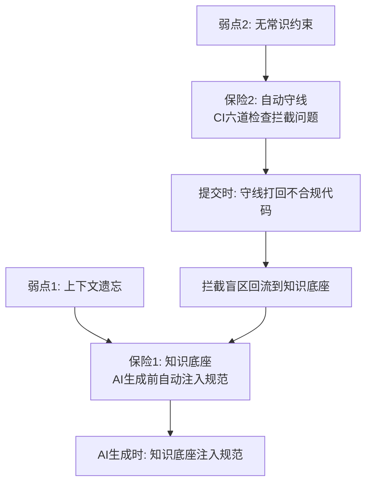
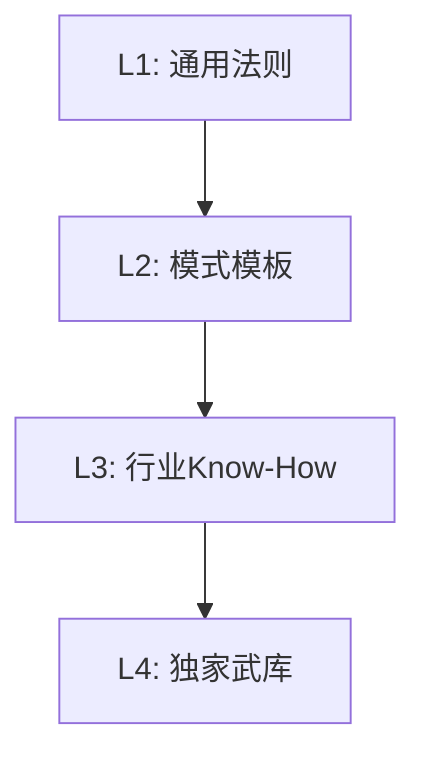
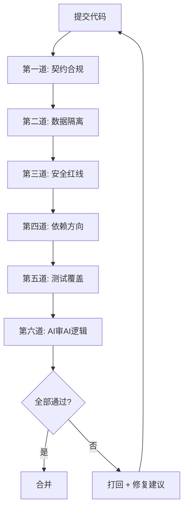
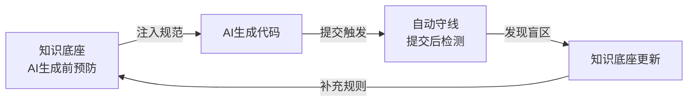

# 知识底座与自动守线：Vibe Coding 的双保险

## 背景：AI 的两个致命弱点

1. **上下文遗忘**：生成 3000 行代码后，架构原则被挤出上下文窗口。
2. **无常识约束**：AI 会生成"技术上完美但业务上致命"的代码。

**两个解法**：知识底座解决"忘性大"，自动守线解决"没常识"。

---

## 一、核心思想：双保险协同架构

- 知识底座管"生成前"（预防），自动守线管"提交后"（检测）。
- 每次拦截暴露的盲区回流到底座（进化）。使用越久，系统越强。

---

## 二、保险一：知识底座——四层分层体系

| 层级 | 内容示例 | 维护者 | 更新频率 |
|:---|:---|:---|:---|
| **L1** | RESTful规范、金额Decimal、数据加密 | 公共服务者 | 季度 |
| **L2** | 微服务模板、事件驱动、CQRS | 公共服务者+部门 | 月度 |
| **L3** | 优惠叠加顺序、退货状态机、PCI-DSS | 业务域负责人 | 双周 |
| **L4** | 禁用MongoDB、历史超卖Case、废弃接口 | 公共服务者 | 实时 |

**注入优先级**：L4（先查禁用/废弃）→ L3（业务关键词匹配）→ L2（技术场景检索）→ L1（全局兜底）。

---

## 三、保险二：自动守线——CI 六道拦截

| 守线 | 检查内容 | 动作 |
|:---|:---|:---|
| **第一道** | API 是否匹配 OpenAPI 定义 | 硬拦截 |
| **第二道** | 是否跨域直连数据库 | 硬拦截 |
| **第三道** | 硬编码密钥、SQL 拼接、明文密码 | 硬拦截 |
| **第四道** | 是否违反领域依赖方向 | 硬拦截 |
| **第五道** | 边界测试是否覆盖极端 Case | 软警告 |
| **第六道** | 独立 AI Agent 审查逻辑 Bug | 标记高风险 |

- **第六道核心**：用独立 AI Agent 审查生成代码，标记金额精度、并发安全、边界条件等高风险片段。人只需审查被标记的 10% 代码。

---

## 四、双保险的协同进化：知识-守线飞轮

- 知识底座越丰富 → AI 生成越规范 → 守线拦截越少。
- 每拦截一次暴露一个盲区，填补后下一轮 AI 质量更高。
- 系统成熟标志：拦截率持续下降，但每次拦截价值持续上升。

---

## 五、公共服务者日常运转清单

| 频率 | 动作 |
|:---|:---|
| **每日** | 查看 CI 拦截日报，确认高风险标记 |
| **每周** | 更新 L4 独家武库，输出守线健康度周报 |
| **每两周** | 审视 L3 行业 Know-How 是否与业务一致 |
| **每月** | 审视 L2 模式模板是否过时 |
| **每季度** | 审视 L1 通用法则是否有新最佳实践 |

---

## 总结

**设计哲学**：信任 AI 的能力，但不信任 AI 的记忆力和判断力。

- **知识底座**是 AI 的外部记忆系统——让 AI 每次生成时像在这个团队工作 10 年。
- **自动守线**是 AI 的底线约束系统——让 AI 代码合并前必须通过规范校验。

双保险的核心在于**持续进化**：运转 6 个月和 1 周的系统，差距在几百条踩坑记录和优化过的拦截规则。**这个差距就是团队的核心护城河。**
